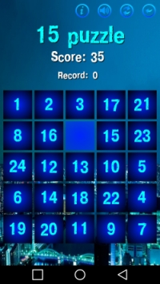

<h1>Android game "15 puzzle"</h1>
Logic puzzle game. The number in the title game "[15 puzzle](https://play.google.com/store/apps/details?id=com.mr_alex.pyatnashki)" is set on the number of cells. Each cell is numbered. One of the cells is not occupied. The player can move the cells by the free cell. Goal of the game "15 puzzle" – moving the cells of the box to achieve the ordering of numbers in ascending order, it is desirable to making as little as possible moves.

......

[ **Google Play**](https://play.google.com/store/apps/details?id=com.mr_alex.pyatnashki)
[ **Yurii Salimov**](https://www.linkedin.com/in/yurii-salimov)